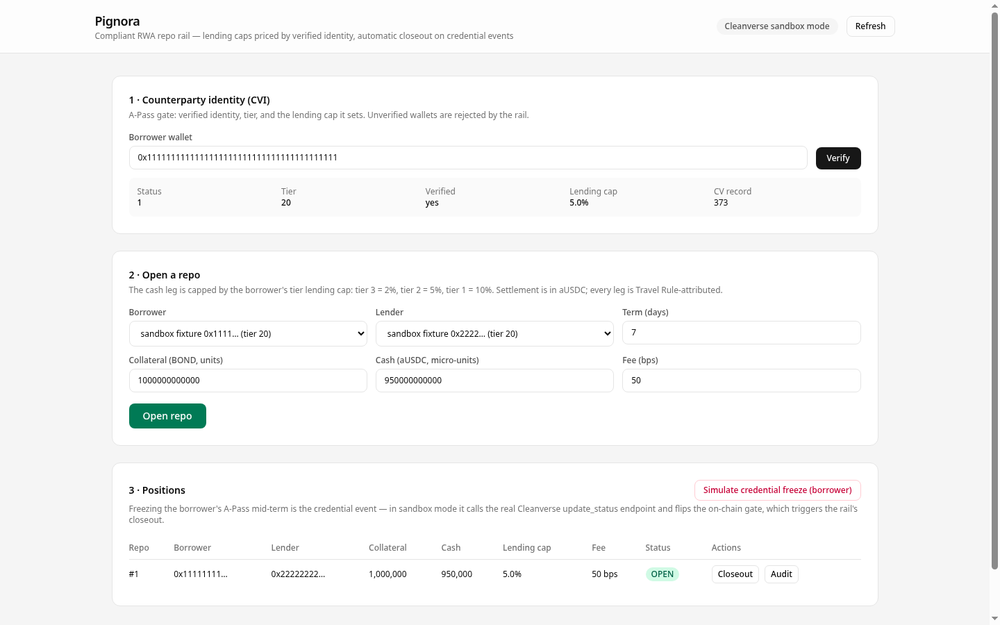
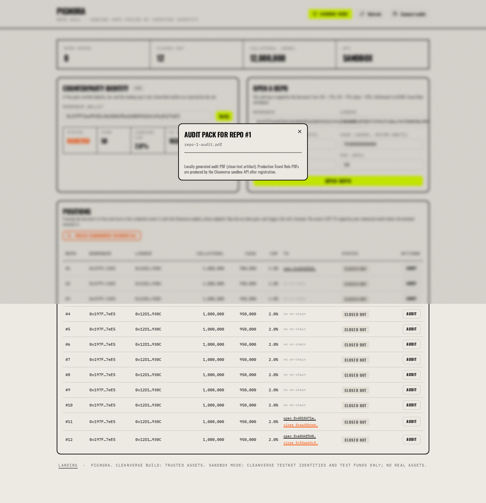
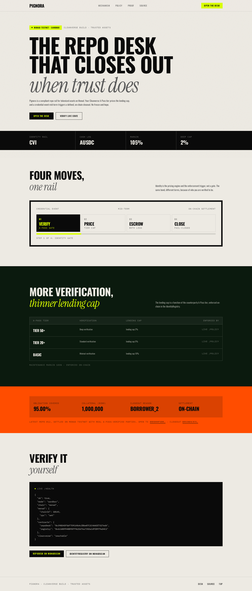
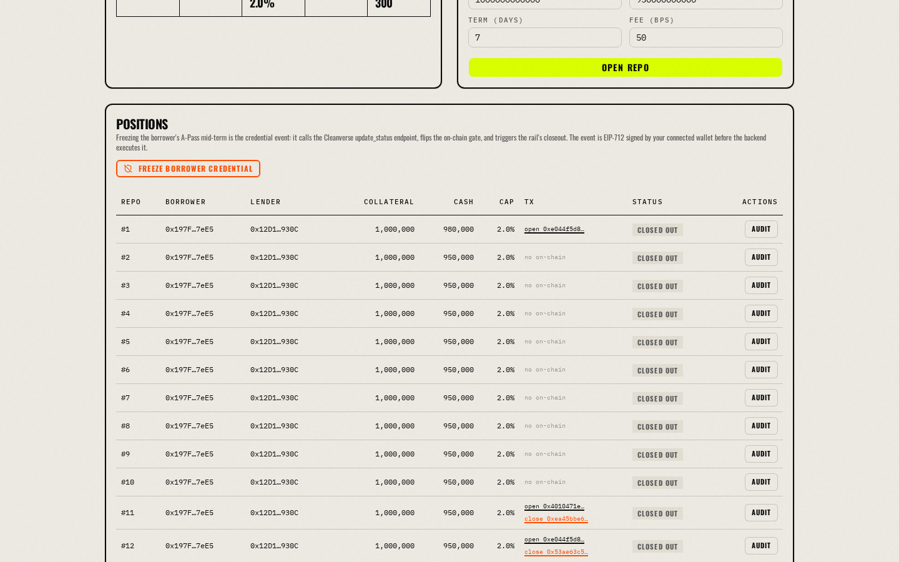

<p align="center">
  
</p>

<h1 align="center">Pignora</h1>

<p align="center">
  <b>Compliant repo rail for tokenized assets — lending caps priced by verified identity, automatic closeout on credential events.</b><br>
  Cleanverse Build: Trusted Assets Hackathon · Track 1 (RWA) · Monad testnet
</p>

<p align="center">
  <a href="https://pignora-desk.vercel.app">Live desk</a> ·
  <a href="docs/ONE-PAGER.md">One-page summary</a> ·
  <a href="docs/demo-script.md">Demo script</a> ·
  <a href="https://testnet.monadscan.xyz/address/0x398D45F56F759Cd4b4cf0be07C2C4AADf7327edA">RepoDesk on MonadScan</a>
</p>

---

## What it is

Repo is how institutions fund themselves — trillions of dollars a day. Pignora brings it on-chain with **identity as the pricing engine and the enforcement trigger, not a gate**:

- The **lending cap is set by the counterparty's Cleanverse A-Pass tier** (0-99 scale: ≥50 → 2%, ≥20 → 5%, ≥10 → 8%). More verification, higher lending cap — the same bond, different terms, purely because of who the counterparty is verified to be.
- **Credential events are protocol events**: a freeze (or revocation/expiry) of the borrower mid-term triggers an automatic margin call and a compliant closeout — collateral covers the obligation, excess returns, and frozen parties fail closed to escrow until verified again.
- Every leg settles in aUSDC, carries **Travel Rule attribution**, and produces an append-only **audit pack with a real PDF**.

## Screenshots

| | |
|:--|:--|
| Identity gate + open repo — tier prices the lending cap | Credential event — closeout state |
|  |  |
| Audit pack console | Architecture |
|  |  |

## Mechanism


```
A-Pass (tier) ──► lending cap ──► repo open (escrowed, Travel Rule anchored)
                                    │
A-Pass event (freeze/revoke/expiry) ┘
        │
        └──► on-chain gate flips ──► margin call ──► compliant closeout
                                     ├─ obligation covered from collateral
                                     └─ excess fail-closed to escrow
```

1. **Identity (CVI)** — `query_apass` returns the counterparty's tier/subTier/group/status/expiry/cvRecordId. The relay mirrors it into an on-chain `IdentityRegistry`; the registry prices the lending cap and gates every repo action (`isActive`).
2. **Verified settlement (CVA)** — the cash leg is aUSDC; the `RepoDesk` escrows both legs until repayment or closeout. Pignora also issues its own verified asset via `atoken/launch` ("Pignora Bond", PNGB01) with an embedded compliance rule — CVA from the issuance stage.
3. **Credential events** — `update_status` freeze/unfreeze flips the real on-chain gate; the relay propagates it to the registry, which is what RepoDesk's closeout path reads. Frozen/revoked parties can never receive — proceeds fail closed to escrow.
4. **Audit** — every repo writes an append-only JSONL ledger plus a generated PDF artifact; the Travel Rule hash is anchored on-chain per repo.

## Verified on-chain (Monad testnet, chain 10143)

Real contracts, real identities, real settlement:

| Contract | Address |
|:--|:--|
| RepoDesk | `0x398D45F56F759Cd4b4cf0be07C2C4AADf7327edA` |
| IdentityRegistry | `0xdcb889940B95FF9625d76a735DaCdFEB979aD4C2` |
| MockBond | `0x13211b8f5983bfdcd2a14d8467631254c3af5a89` |
| MockUSD | `0xa66155a4c3ff24c0300afa66de6ff8d5f7310aea` |

The settlement E2E (`backend/scripts/testnet-repo.js`) used real sandbox A-Passes (tier 50, cvRecordId 1832/1833), opened a repo at the tier-priced 2% lending cap, fired a real `update_status` freeze, and executed the closeout:

| Step | Tx |
|:--|:--|
| `openRepo` (2% lending cap, tier 50) | `0xb6fff6a96c2b0ef69bfbed1fe004af0648a0fd7198ccca66f5b7826d667f3f3e` |
| Freeze (update_status + on-chain mirror) | `0x7df33be6172afcc4da0832b4c6291af0bd45511c32e40e1ae67d71df929d27e0` |
| `executeCloseout` | `0x10241e21e819c65878db6f03e4f21d5f93d848ae941dafc147cd0ff5cabe59ae` |

Closeout result (matches the Foundry expectations exactly): lender received **984,900,000,000** BOND (98.49% obligation coverage), borrower excess **15,100,000,000** fail-closed to escrow.

## Verification

```
contracts: 22 Foundry tests green (identity gates, tier pricing, margin calls,
            closeout, escrow, revert paths)
backend:   8 node tests green (hermetic mock) + live sandbox E2E
frontend:  typecheck + lint clean, production build green
```

## Quickstart

```bash
# contracts
cd contracts && forge build && forge test

# backend (live sandbox — add CLEANVERSE_API_ID / CLEANVERSE_API_KEY to .env)
cd backend && cp .env.example .env && npm install && npm test && node src/server.js

# frontend
cd frontend && npm install && npm run dev  # :3000 -> /dashboard

# Monad testnet deploy (needs a funded PRIVATE_KEY)
export PRIVATE_KEY=... && bash scripts/deploy-monad.sh
```

## Live deployment

- Desk: https://pignora-desk.vercel.app (hosted, connects to the hosted API)
- API: https://backend-six-rho-86.vercel.app (`/health`, `/identity/:address`, `/repos`, `/repos/:id/audit`)
- Contracts: Monad testnet (addresses above) — the "live demo URL or testnet deployment" submission item

## Repository structure

```
contracts/   Foundry — IdentityRegistry, RepoDesk, mocks, 22 tests, deploy script
backend/     Node API — Cleanverse client (AES-CBC), relay, audit (JSONL + PDF), tests, E2E scripts
frontend/    Next.js treasury desk
scripts/     deploy-monad.sh (one-command testnet pipeline)
docs/        one-pager, demo script, application copy, screenshots
```

## Honest scope

- Testnet + sandbox only; no legal advice; no real funds involved.
- The settlement E2E used the local MockUSD cash leg because the institution aUSDC faucet pool ran dry at demo time — swapping one address uses the real aUSDC (delivery proven: tx `0x096cfcdf…`).
- A-Pass tier is numeric 0-99; the lending-cap bands (≥50 → 2%, ≥20 → 5%, ≥10 → 8%) are Pignora's policy mapping, owner-overridable per tier on-chain.

## License

MIT
