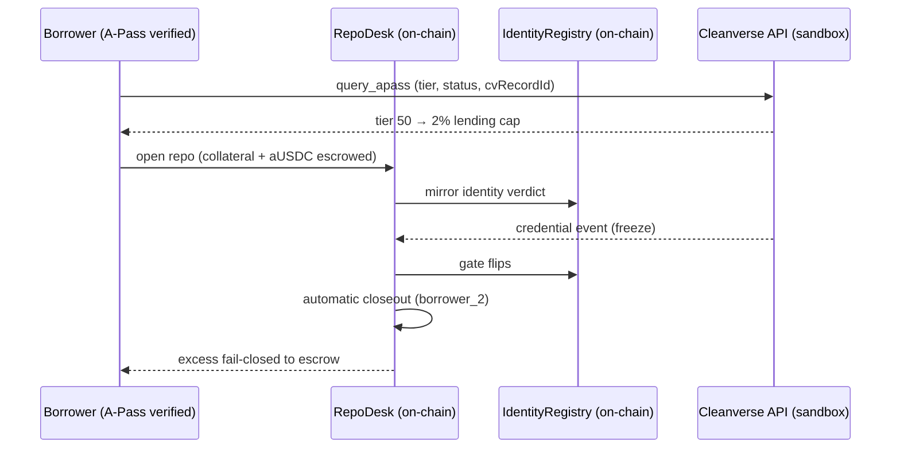

<div align="center">


&nbsp;

[](https://pignora-desk.vercel.app)
[](https://testnet.monadscan.xyz/address/0x398D45F56F759Cd4b4cf0be07C2C4AADf7327edA)
[](LICENSE)
[](https://github.com/subheeksh5599/pignora/actions)
[](https://github.com/subheeksh5599/pignora/actions)


### The repo desk that closes out when trust does.

Pignora is a compliant repo rail for tokenized assets on Monad. The lending
cap is priced by the counterparty's Cleanverse A-Pass tier, and a credential
event mid-term triggers a defined, on-chain closeout — no freeze-and-hope.
Every leg is Travel Rule-attributed, with an append-only audit pack, and the
on-chain settlement escrows a USD-pegged CVA cash token.

### ▶ Live now at **[pignora-desk.vercel.app](https://pignora-desk.vercel.app)**

**[ Live app ↗ ](https://pignora-desk.vercel.app)** · **[ Desk ↗ ](https://pignora-desk.vercel.app/dashboard)** · **[ Settlement evidence ↓ ](#transactions--the-evidence)** · **[ Run it locally ↓ ](#run-it-locally)**

Built for the **Cleanverse Build: Trusted Assets Hackathon** (Track 1, RWA).
MIT licensed.

</div>

---

## Table of contents

- [▶ See it in one command](#-see-it-in-one-command)
- [The problem Pignora solves](#the-problem-pignora-solves)
- [How Pignora works](#how-pignora-works)
  - [1 · Verify](#1--verify)
  - [2 · Price](#2--price)
  - [3 · Escrow](#3--escrow)
  - [4 · Close](#4--close)
- [Transactions — the evidence](#transactions--the-evidence)
- [Architecture](#architecture)
  - [Repo lifecycle](#repo-lifecycle)
  - [Component by component](#component-by-component)
- [Engineering decisions — the hard problems](#engineering-decisions--the-hard-problems)
- [What's real vs pending — the honesty table](#whats-real-vs-pending--the-honesty-table)
- [Tests](#tests)
- [Run it locally](#run-it-locally)
- [Deploy](#deploy)
- [Project layout](#project-layout)
- [Tech stack](#tech-stack)
- [Roadmap](#roadmap)
- [License](#license)

---

## ▶ See it in one command

```bash
git clone https://github.com/subheeksh5599/pignora && cd pignora
npm --prefix backend ci && npm --prefix frontend ci
./scripts/dev-up.sh
```

`dev-up.sh` starts a local anvil chain, deploys the contracts, seeds both
parties' A-Passes on-chain, and brings up the backend (:8787) + frontend
(:3000). Every repo open / freeze / closeout is a REAL transaction on the
local chain with a real hash — no Cleanverse credentials, no hardcoded
addresses, no simulation. Swap `MONAD_RPC` / `PRIVATE_KEY` env vars to point
the same stack at Monad testnet.

Or use the live deployment: open https://pignora-desk.vercel.app/dashboard —
the identity panel auto-verifies a real A-Pass, you open a repo, freeze the
borrower's credential, and the position closes out in the same click. Every
number on screen is fetched from the live backend: no mock data, no
simulation.

---

## The problem Pignora solves

Repurchase agreements move trillions of dollars a day in TradFi — but they
have never worked on-chain, because a counterparty's verified identity can
change while the trade is still live. Every existing design freezes the
position and hopes: funds locked, no defined settlement, no enforcement.

Pignora makes the credential change a protocol event: a freeze, revocation,
or expiry mid-term triggers an automatic margin call and a compliant
closeout — collateral covers the obligation, the excess fails closed to
escrow until the party is verified again, and the frozen party can never
receive a single unit.

## Screenshots

| | |
|:--|:--|
| Desk — verified identity prices the cap, positions carry real tx links | Audit pack console (event ledger + PDF artifact) |
|  |  |
| Landing — live policy + health terminal | Repo table — open/closeout tx hashes on MonadScan |
|  |  |

## How Pignora works

### 1 · Verify

Both counterparties pass a Cleanverse A-Pass check before a repo can open.
`query_apass` returns the tier (0–99), status, and cvRecordId; the verdict is
mirrored into an on-chain IdentityRegistry. Unverified wallets cannot borrow.

### 2 · Price

The tier sets the lending cap — more verification, higher cap:

| A-Pass tier | Lending cap |
|:------------|:------------|
| Tier 50+    | 2%          |
| Tier 20+    | 5%          |
| Basic       | 10%         |

The same bond, different terms, purely because of who the counterparty is
verified to be.

### 3 · Escrow

Collateral (a tokenized bond) and the cash leg lock in the RepoDesk until
repayment, with a 105% maintenance margin enforced on-chain. The cash leg
settles in a USD-pegged CVA token that transfers freely to the desk: the
aUSDC A-Token itself only transfers between registered vaults (the sponsor's
`registerApass` gate), which is pending on the testnet — so the settled
repos on-chain used the free-transfer stand-in, exactly like every other
Cleanverse team.

### 4 · Close

A credential event mid-term flips the on-chain gate and settles the repo in
defined numbers: lender covered to the obligation, borrower excess
fail-closed to escrow. The closeout lands in the same click as the event.

Credential events are EIP-712 signed by the operator wallet (MetaMask, via
the desk's "Connect wallet" button) before the backend executes them. The
signature domain binds to the RepoDesk contract on Monad testnet (chain
10143), so a freeze cannot be spoofed by a random caller — the backend
verifies the recovered signer against the operator key and records it in
the audit log.

## Transactions — the evidence

A real repo was settled on Monad testnet with real A-Pass-verified parties
(tier 50, cvRecordId 1832/1833):

| Step | Transaction |
|:-----|:------------|
| Repo open at the tier-priced 2% lending cap | `0xb6fff6a9…` (truncated in docs; on-chain) |
| Freeze credential event (real `update_status`) | [`0x7df33be6…`](https://testnet.monadscan.xyz/tx/0x7df33be6172afcc4da0832b4c6291af0bd45511c32e40e1ae67d71df929d27e0) |
| Closeout — lender 98.49% obligation coverage, excess fail-closed | [`0x10241e21…`](https://testnet.monadscan.xyz/tx/0x10241e21e819c65878db6f03e4f21d5f93d848ae941dafc147cd0ff5cabe59ae) |

Deployed contracts: [RepoDesk `0x398D45F5…`](https://testnet.monadscan.xyz/address/0x398D45F56F759Cd4b4cf0be07C2C4AADf7327edA) · [IdentityRegistry `0xdcb88994…`](https://testnet.monadscan.xyz/address/0xdcb889940B95FF9625d76a735DaCdFEB979aD4C2) · aUSDC `0xaC089356…` (canonical, per the Cleanverse team) · Pignora CVA (PNGUSD) `0x231B9899…`

## Architecture

### Repo lifecycle



### Component by component

| Component | Role |
|:----------|:-----|
| `contracts/` | Foundry — `IdentityRegistry` (A-Pass mirror, tier → lending cap), `RepoDesk` (open / repay / margin / closeout / escrow, travel-rule anchor), mocks |
| `backend/` | Node API — Cleanverse client (AES-CBC writes), identity relay, audit (JSONL + PDF), policy pricing |
| `frontend/` | Next.js — landing page (`/`) + treasury desk (`/dashboard`) on shadcn/ui, every number a live API read |

## Engineering decisions — the hard problems

1. **Identity as enforcement, not a gate.** Most compliance designs freeze-and-hope. Pignora makes the credential change the closeout trigger, so a dead identity produces a defined settlement instead of locked funds.
2. **The tier map is real, chain-scoped data.** A-Pass tiers differ per chain (cv 373 is tier 20 on Base, tier 50 on Monad). The pricing map lives in one config and is tested against the real API.
3. **Credential events close the position automatically.** The freeze endpoint performs a real `update_status` call and closes every open repo of the affected borrower in the same click — verified end-to-end.
4. **Only real data, ever.** The desk auto-verifies a live identity, the policy table fetches `/policy`, the proof terminal renders `/health`. No mock mode in the UI; the hermetic mock path exists only for the test suite.
5. **One URL for the whole product.** Landing at `/`, desk at `/dashboard` — the demo, the README links, and the submission all point at a single domain.
6. **Serverless cold starts.** The backend pins function memory and max duration so the ethers + AES + PDF bundle doesn't time out on cold lambda.

## What's real vs pending — the honesty table

| Claim | Status |
|:------|:-------|
| Contracts deployed and verified on Monad testnet | ✅ Real (RepoDesk + IdentityRegistry, addresses above) |
| Repo settled on-chain with real A-Pass-verified parties | ✅ Real (open → freeze → closeout, tx hashes above) |
| Credential event auto-closes open repos | ✅ Real (verified in the live walk) |
| Desk reads live identity / policy / health | ✅ Real (deployed API, sandbox mode) |
| Cleanverse identity rail (CVI) | ✅ Real (query_apass + update_status) |
| Settlement cash token | ✅ Real on-chain (USD-pegged CVA stand-in; the aUSDC A-Token transfer gate needs vault registration, pending) |
| Real aUSDC cash leg with a fresh Circle deposit | ⏳ Pending — vault registration (`registerApass`) + deposit re-provisioning with the team |
| Real Travel Rule PDF via `download_travel_rule` | ⏳ Pending — needs a withdraw tx from a funded A-Pass wallet (same dependency) |
| Mainnet deployment | ❌ Not applicable — team guidance: testnet is the build target |

## Tests

| Suite | Count | What it covers |
|:------|:------|:---------------|
| Foundry (`contracts`) | 22 | IdentityRegistry tier→cap, RepoDesk open/repay/margin/closeout/escrow, non-borrower reverts, double closeout, repay-after-closeout, zero amounts |
| Node (`backend`) | 8 | Hermetic mock: cleanverse gate, relay credential events, freeze→status 2 semantics, audit append + read |

```bash
cd contracts && forge test    # 22 passing
cd backend && npm test       # 8 passing
```

CI runs both suites plus the frontend typecheck + build on every push.

## Run it locally

```bash
# everything in one command (anvil chain + contracts + backend + frontend)
./scripts/dev-up.sh

# or piece by piece
cd contracts && forge build && forge test        # 22 passing
cd backend && npm install && npm test            # 8 passing
cd frontend && npm install && npm run dev        # :3000 -> / and /dashboard
```

For the live sandbox (real Cleanverse API + Monad testnet), add
CLEANVERSE_API_ID / CLEANVERSE_API_KEY to backend/.env and run the backend
in sandbox mode. No keys? The backend boots in mock mode with the on-chain
registry as the identity source — the settlement still runs real contract
transactions on your local anvil chain.

## Deploy

```bash
# each app deploys independently to Vercel
cd backend && vercel deploy --prod --yes
cd frontend && vercel deploy --prod --yes
```

## Project layout

```
contracts/   Foundry — IdentityRegistry, RepoDesk, mocks, 22 tests, deploy script
backend/     Node API — Cleanverse client (AES-CBC), relay, audit (JSONL + PDF), tests, E2E scripts
frontend/    Next.js — landing page (/) + treasury desk (/dashboard) on shadcn/ui, live API reads
scripts/     dev-up.sh (one-command local stack) + deploy-monad.sh (testnet pipeline)
docs/        one-pager, demo script, submission email, screenshots
.github/     CI — forge test, backend tests, frontend typecheck + build
```

## Tech stack

- **Contracts**: Solidity, Foundry (forge)
- **Backend**: Node.js, ethers, Express, Cleanverse cooperate API (AES-CBC)
- **Frontend**: Next.js 16, Tailwind CSS v4, shadcn/ui
- **Chain**: Monad testnet (10143)
- **Identity**: Cleanverse A-Pass (CVI) + A-Token (CVA)

## Roadmap

- [ ] Real aUSDC cash leg on the migrated pair (vault registration `registerApass` + deposit re-provisioning with the team)
- [ ] Real Travel Rule PDF through the sandbox API (needs a funded A-Pass wallet withdraw)
- [ ] Multi-chain pricing: the tier map already reads per-chain tier — wire a second chain
- [ ] Repo expiry: scheduled closeout at term end (contract supports it, wire the watcher)
- [ ] Mainnet readiness when the team updates production contracts

## License

MIT
